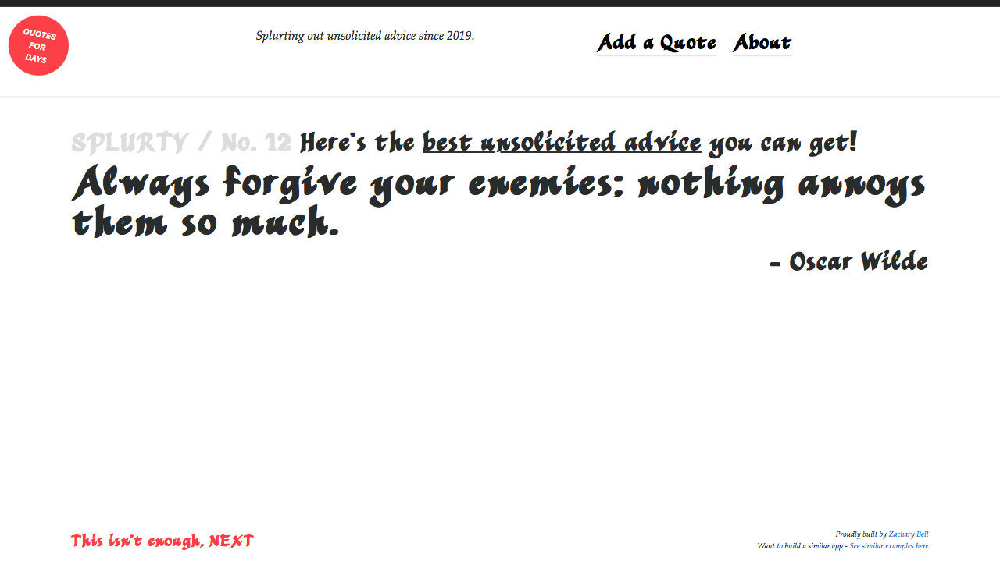

# Splurty

Splurty is a random quote generator, which will display a quote from a database of crowd-sourced entries. This app utilizes Bootstrap for styling and is mobile responsive.

## Built With

* Ruby on Rails 5.2.3
* Ruby 2.5.3

## Gems

* [Bootstrap](https://github.com/twbs/bootstrap-rubygem) - Styling and layout
* [Simple Form](https://github.com/heartcombo/simple_form) - Form handler and layout

## Acknowledgments

* [The Firehose Project](https://thefirehoseproject.com)
